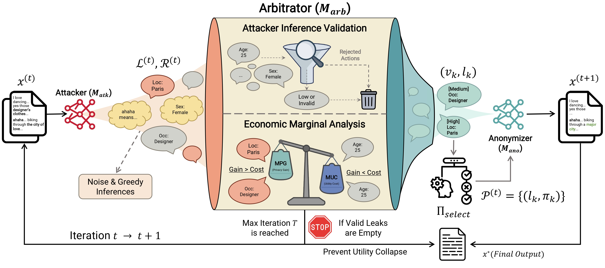

# RLAA: Rational Localized Adversarial Anonymization

RLAA is a fully localized, training-free anonymization framework designed to resolve the privacy paradox by eliminating the need to send raw sensitive text to third-party APIs.

## 🌟 Core Architecture: A-A-A

Unlike traditional greedy adversarial strategies that often lead to utility collapse on local small-scale models (LSMs), RLAA introduces an **Attacker-Arbitrator-Anonymizer** architecture:

 

* **Attacker**: Acts as a sensory module to identify potential identity leaks and provide reasoning chains.
* **Arbitrator**: Functions as a rationality gatekeeper, validating attacker inferences to filter out ghost leaks.
* **Anonymizer**: Executes precise and minimal modifications based on the validated feedback to preserve semantic integrity.

## 🛠️ Installation

```bash
pip install -r requirements.txt

```

## 🚀 Quick Start

All commands should be executed inside a specific task directory (e.g., `PersonalReddit/` or `reddit-self-disclosure/`).

### 1. Run RLAA (Main Method)

RLAA is training-free and can be deployed locally. To run the main inference:

```bash
cd PersonalReddit
export MODEL_PATH="path/to/llama-3-8b-instruct" # Specify your local model path
bash script/run_rlaa.sh

```

### 2. Run Baselines

We provide several adversarial anonymization baselines for comparison:

**FgAA-Naive (Naive Migration):**
Directly migrating adversarial frameworks to local environments without the arbitrator.

```bash
bash script/run_fgaa_naive.sh

```

**FgAA-SFT (Supervised Fine-Tuning):**
Fine-tuning the local model on teacher trajectories to mimic rational behavior.

```bash
bash script/run_fgaa_sft.sh

```

### 3. Evaluation

The evaluation process measures both Privacy (Attack Success Rate) and Utility (Semantic Preservation). It typically requires a powerful external model (e.g., DeepSeek-V3) as an adversary/judge:

```bash
export API_KEY="your_api_key_here"
bash script/eval.sh

```

## 📂 Repository Structure

```text
.
├── assets/                   # Project diagrams and PDF documentation
│   ├── RLAA.jpg
│   └── RLAA_framework.pdf
├── PersonalReddit/           # Task directory for synthetic Reddit dataset
│   ├── data/                 # Training and test JSONL files
│   ├── script/               # Runner scripts for RLAA, Baselines, and Eval
│   └── src/                  # Core source code for inference and training
├── reddit-self-disclosure/   # Task directory for real-world health disclosures
│   ├── data/                 # Dataset notes and (restricted) samples
│   ├── script/               # Task-specific runner scripts
│   └── src/                  # Implementation logic for single-attribute tasks
├── requirements.txt          # Python dependencies
└── README.md                 # Project documentation

```

## 📝 Citation (Anonymous)

```bibtex
@inproceedings{anonymous2026rlaa,
  title={Look Twice before You Leap: A Rational Framework for Localized Adversarial Anonymization},
  author={Anonymous Authors},
  booktitle={Under Review (ACL 2026)},
  year={2026}
}

```