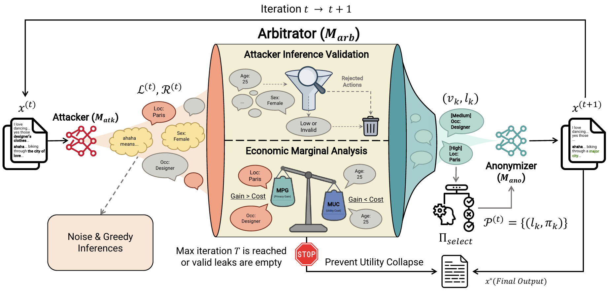

# RLAA: Rational Localized Adversarial Anonymization

[](https://aclanthology.org/2026.findings-acl.274)
[](https://arxiv.org/abs/2512.06713)
[](https://github.com/SowingG2333/RLAA)

RLAA is a fully localized, training-free anonymization framework designed to address the privacy paradox in LLM-based text anonymization by eliminating the need to send raw sensitive text to third-party APIs.

## 🌟 Core Architecture: A-A-A

Unlike greedy adversarial strategies that often lead to utility collapse on local small-scale models (LSMs), RLAA introduces an **Attacker-Arbitrator-Anonymizer** architecture:



* **Attacker**: Acts as a sensory module to identify potential privacy leaks and provide reasoning chains.
* **Arbitrator**: Functions as a rationality gatekeeper, validating attacker inferences to filter out ghost leaks.
* **Anonymizer**: Executes precise and minimal modifications based on validated feedback to preserve semantic integrity.

RLAA is designed to reduce destructive over-editing while maintaining a stronger privacy-utility trade-off in localized deployment settings.

## 🛠️ Installation

```bash
pip install -r requirements.txt
````

## 🚀 Quick Start

All commands should be executed from the **project root directory**.

### 1. Run RLAA

RLAA is training-free and can be deployed locally.

**PersonalReddit**

```bash
export MODEL_PATH="path/to/llama-3-8b-instruct"
bash PersonalReddit/script/run_rlaa.sh
```

**reddit-self-disclosure**

```bash
export MODEL_PATH="path/to/llama-3-8b-instruct"
bash reddit-self-disclosure/script/run_rlaa.sh
```

### 2. Run Baselines

We provide several anonymization baselines for comparison.

**FgAA-Naive (Naive Migration)**
Directly migrates the adversarial anonymization framework to local environments without the arbitrator.

```bash
bash PersonalReddit/script/run_fgaa_naive.sh
```

**FgAA-SFT (Supervised Fine-Tuning)**
Fine-tunes the local model on teacher trajectories to imitate stronger anonymization behavior.

```bash
export API_KEY="your_api_key_here"
bash PersonalReddit/script/gen_data.sh
bash PersonalReddit/script/sft.sh
bash PersonalReddit/script/run_fgaa_sft.sh
```

**Other Baselines**
Additional baselines such as SEAL and DP-BART are organized in the corresponding task directories under `script/` and `src/`.

### 3. Evaluation

The evaluation process measures both **Privacy** (attack success rate) and **Utility** (semantic preservation). Depending on your setup, evaluation may require a stronger external model as the attacker or judge.

```bash
export API_KEY="your_api_key_here"
bash PersonalReddit/script/eval.sh
```

## 📂 Repository Structure

```text
.
├── assets/                   # Project documentation assets
│   └── RLAA.png
├── PersonalReddit/           # Multi-attribute anonymization benchmark
│   ├── data/                 # Training/test files and task-specific resources
│   ├── script/               # Runner scripts for RLAA, baselines, and evaluation
│   └── src/                  # Core source code for inference and training
├── reddit-self-disclosure/   # Single-attribute anonymization benchmark
│   ├── data/                 # Dataset notes and task-specific resources
│   ├── script/               # Task-specific runner scripts
│   └── src/                  # Implementation code
├── requirements.txt          # Python dependencies
└── README.md                 # Project documentation
```

## 🧪 Datasets

We evaluate RLAA on two benchmarks:

* **PersonalReddit**: A synthetic Reddit-style benchmark with multiple fine-grained private attributes.
* **reddit-self-disclosure**: A benchmark built from real-world self-disclosures involving health-related information.

Please refer to the corresponding dataset folders for task-specific details.

## 📊 Reproducibility

To reproduce the main experiments:

1. Prepare the local model checkpoint.
2. Run RLAA on each dataset.
3. Run the baseline methods.
4. Execute the evaluation scripts.
5. Aggregate results from the generated outputs.

Before running experiments, please make sure that model paths, API keys, and environment-dependent options in the scripts are properly configured.

## 📝 Paper

**Look Twice before You Leap: A Rational Framework for Localized Adversarial Text Anonymization**
Accepted to **Findings of the Association for Computational Linguistics: ACL 2026**

* Paper: [https://aclanthology.org/2026.findings-acl.274](https://aclanthology.org/2026.findings-acl.274)
* arXiv: [https://arxiv.org/abs/2512.06713](https://arxiv.org/abs/2512.06713)

## 📚 Citation

```bibtex
@inproceedings{duan2026look,
  title = {Look Twice before You Leap: A Rational Framework for Localized Adversarial Text Anonymization},
  author = {Duan, Donghang and Zheng, Xu and He, Yuefeng and Mu, Chong and Cai, Leyi and Zhang, Lizong},
  booktitle = {Findings of the Association for Computational Linguistics: ACL 2026},
  year = {2026}
}
```

## 🙏 Acknowledgement

If you find our work useful, please consider citing our paper.
